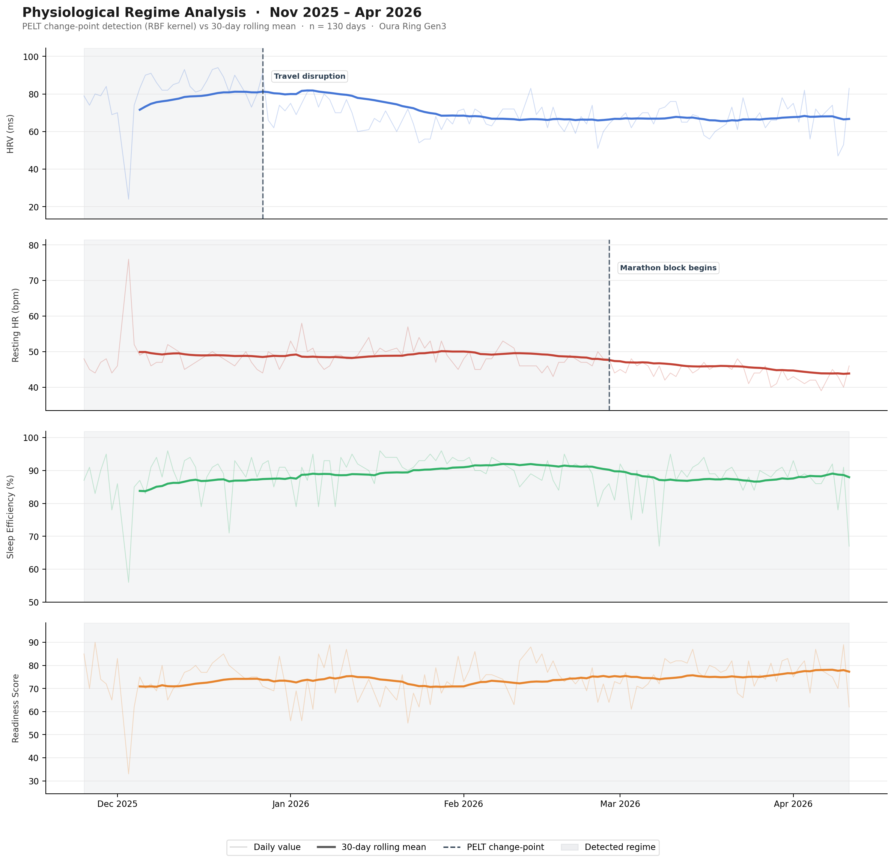

# Health Analytics Platform

A longitudinal personal health data platform and methods portfolio investigating
physiological nonstationarity in wearable sensor data.

---

## Thesis

Commercial wearable algorithms compute recovery and readiness scores against a
rolling baseline that assumes the underlying physiological signal is stationary
within a window. This portfolio investigates what happens when that assumption
fails — empirically, operationally, and predictively — across three connected
projects.

---

## Portfolio Structure

| Project | Status | Description |
|---|---|---|
| [Project 1 — Physiological Nonstationarity Investigation](#project-1--physiological-nonstationarity-investigation) | ✅ Complete | Stationarity tests, change-point detection, detection latency analysis |
| [Project 2 — Regime-Aware Operations Dashboard](#project-2--regime-aware-operations-dashboard) | 🔄 In Progress | Self-hosted Metabase dashboard with within-regime baseline computation |
| [Project 3 — Training Load as a Predictor of Regime Transitions](#project-3--training-load-as-a-predictor-of-regime-transitions) | 📋 Queued | Does training load predict the direction of physiological regime shifts? |

---

## Project 1 — Physiological Nonstationarity Investigation

**[→ Full analysis and findings](analyses/physiological_nonstationarity/README.md)**

Applied ADF and KPSS stationarity tests to 130 days of personal Oura Ring data
across four signals: HRV, resting heart rate, sleep efficiency, and Oura's
composite readiness score. HRV and resting HR are trend-stationary — exhibiting
directional drift inconsistent with a fixed-mean baseline. Sleep efficiency and
readiness score are stationary in this window.

PELT change-point detection (RBF kernel) identified two discrete regime
transitions, both physiologically annotated:

| Date | Signal | Direction | Event |
|---|---|---|---|
| 2025-12-27 | Average HRV | ↓ 16.7% | Travel disruption — 3-week interstate stay |
| 2026-02-27 | Resting HR | ↓ 9.3% | Marathon training block initiated |

A 30-day rolling mean lagged PELT by 7 days on the HRV transition and failed to
detect the resting HR transition entirely. This detection latency result is the
quantitative justification for the regime-aware baseline approach in Project 2.



**Methods:** ADF · KPSS · PELT (ruptures, RBF kernel) · Detection latency
analysis  
**Stack:** Python · Snowflake · dbt · statsmodels · ruptures · matplotlib

---

## Project 2 — Regime-Aware Operations Dashboard

*In progress.*

Self-hosted Metabase dashboard operationalizing the Project 1 findings. Rather
than computing signal baselines against a rolling global mean, baselines are
computed within PELT-detected regimes — partitioning each signal's history at
detected change-point boundaries before calculating reference statistics.

The detection latency result from Project 1 — a naive rolling mean missing a
real 4.54 bpm resting HR regime shift entirely — motivates this design decision
quantitatively. Power BI equivalent DAX measures are documented in
`analyses/regime_dashboard/power_bi_equivalent/` as a stack portability reference.

**Methods:** Regime-aware baseline computation · Metabase · Snowflake  
**Stack:** Metabase (Docker) · Snowflake · dbt · Python

---

## Project 3 — Training Load as a Predictor of Regime Transitions

*Queued.*

Takes the annotated change-points from Project 1 as outcome variables and asks
whether training load metrics in the preceding window — cumulative distance,
acute:chronic workload ratio, elevation gain — were already signaling the coming
regime transition. Moves from descriptive detection to predictive modeling.

**Methods:** Time-lagged feature construction · logistic / ordinal regression ·
Strava training load metrics  
**Stack:** Python · Snowflake · dbt · scipy · statsmodels

---

## Data Infrastructure

Four ingestion sources, all production-grade and running on a scheduled pipeline:

| Source | Method | Schema |
|---|---|---|
| Oura Ring | REST API | `RAW_OURA` |
| Apple Health | HealthKit XML export | `RAW_APPLE_HEALTH` |
| RENPHO / HealthKit | HealthKit XML export | `RAW_APPLE_HEALTH` |
| Strava | OAuth2 with auto-refresh | `RAW_STRAVA` |

All sources land in Snowflake, transform through dbt staging models, and surface
in a unified daily summary mart: `MART_HEALTH.DAILY_HEALTH_SUMMARY`.

**Stack:** Python 3.12 · pyenv · uv · Snowflake · dbt · Ubuntu 22.04

---

## Repository Structure

```
health-analytics-platform/
├── ingestion/               # Python ingestion scripts (Oura, Apple Health, Strava)
├── dbt/                     # dbt project — staging models and mart
│   ├── models/
│   │   ├── staging/
│   │   └── marts/
├── analyses/
│   ├── physiological_nonstationarity/   # Project 1
│   │   ├── analysis.py
│   │   ├── README.md
│   │   └── results/
│   └── ...                              # Projects 2, 3 as added
└── README.md
```

---

## Background

Built to support a research program in applied physiological monitoring — personal
data as a methodological testbed for techniques relevant to healthcare workforce
monitoring, clinical remote patient monitoring, and sports science. The n=1
constraint is real and documented honestly in each analysis; the methods
generalize to multi-subject cohorts and are framed as such in the research
directions sections.

**Author:** Hemanth Allamaneni  
MS Applied Cognition and Neuroscience (HCI and Intelligent Systems), UT Dallas, 2025  
[github.com/hemanthallamaneni](https://github.com/hemanthallamaneni)