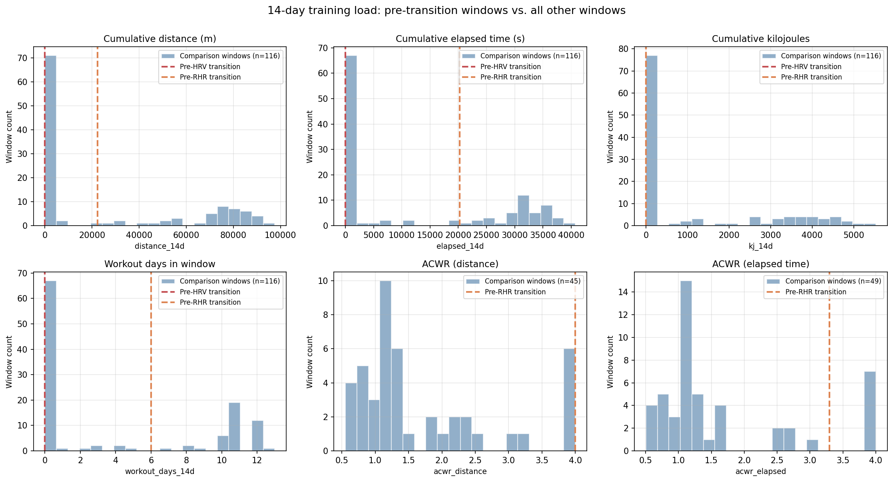

# Physiological Nonstationarity in Wearable Sensor Data: A Methodological Case Study on Regime-Aware Baselines

**Author:** Hemanth Allamaneni  
**Affiliation:** MS Applied Cognition and Neuroscience (HCI and Intelligent Systems), The University of Texas at Dallas  
**Date:** April 2026  

## Abstract

Commercial wearable algorithms assume that human physiological signals are stationary within a rolling baseline window, computing daily readiness and recovery scores against a slowly adapting global mean. This assumption risks misclassifying genuine biological adaptation or systematic environmental disruption as transient noise. This paper tests the stationarity assumption empirically using continuous longitudinal data spanning 130 days from four sources (Oura Ring, Apple HealthKit, RENPHO, and Strava). Joint application of Augmented Dickey-Fuller (ADF) and Kwiatkowski-Phillips-Schmidt-Shin (KPSS) tests demonstrates that heart rate variability (HRV) and resting heart rate (RHR) are trend-stationary, rather than stationary. By applying Pruned Exact Linear Time (PELT) change-point detection, we identify two discrete, physiologically annotated regime transitions—one driven by travel disruption and the other by sustained aerobic training overload. We show that a naive 30-day rolling baseline lags regime transitions by up to a week and entirely fails to detect gradual, sustained cardiac adaptation. In response, we detail the system architecture for a fully reproducible, declarative, and regime-aware self-hosted analytics platform. We conclude that commercial baseline operations suppress valid regime structure, and demonstrate that dynamic regime boundaries provide a more actionable operational metric for personal telemetry.

---

## 1. Introduction

The quantitative core of the modern consumer wearable ecosystem is the daily composite score. Platforms such as Oura, Whoop, and Apple Health compute derivatives of readiness, recovery, and physiological strain by comparing acute overnight metrics—specifically resting heart rate (RHR) and heart rate variability (HRV)—to a rolling longitudinal baseline. 

This analytical foundation relies implicitly on the assumption of physiological **stationarity**. It assumes that the user's underlying physiological state exhibits a fixed mean and constant variance over the baseline calculation window (typically 14 to 30 days). Deviations from this mean are interpreted as transient acute stress (e.g., a poor night of sleep, acute illness, or an intense training session) rather than an orthogonal shift in the baseline itself.

However, continuous physiological data fundamentally violates this assumption during periods of significant lifestyle change, environmental disruption, or structured physical training. When an individual adopts an endurance training program, the resulting cardiovascular adaptation (such as increased stroke volume resulting in a lowered RHR) permanently pulls the daily metric down. A stationary rolling-mean algorithm treats this adaptation as consecutive days of "excellent" deviations until the 30-day window slowly swallows the new regime, pulling the baseline down with it. Similarly, when transitioning across time zones or encountering extended social disruption, HRV may suppress systemically. The rolling baseline lags this transition, penalizing the user for standardizing at a lower homeostatic set-point.

This paper asks the natural operational question: what happens when the stationarity assumption fails? We document an applied research program demonstrating this failure empirically, characterizing the latency cost of naive rolling means, and detailing the engineering pipeline required to implement **regime-aware** baselines that capture the step-function nature of true physiological adaptation. 

---

## 2. Related Work

The tension between static analytical models and continuous physiological adaptation is well-documented in the sports science and clinical monitoring literature.

**Physiological Stationarity in Athletes.** Plews et al. (2013) demonstrated that HRV in trained athletes is not well-described by a stationary process. Systematic drift occurs across macro-cycles of training, peaking phases, and off-seasons. They argue that regime-level shifts are substantively fundamentally different from day-to-day noise, demanding dynamic analytical methods rather than static thresholds. Similarly, Gabbett (2016) popularized the acute-to-chronic workload ratio (ACWR) to explicitly model the dynamic relationship between a moving short-term load and a longer-term physiological base, acknowledging that identical acute stimuli evoke different biological responses depending on the chronic physiological regime.

**Change-Point Detection (CPD).** Retrospective and online change-point detection methods are widely utilized to identify structural breaks in noisy time-series data. Killick, Fearnhead, and Eckley (2012) introduced Pruned Exact Linear Time (PELT), providing an computationally efficient ($O(N)$) exact search methodology for segmenting time-series under a defined cost function. To address the need for real-time inference, Adams and MacKay (2007) formalized Bayesian Online Changepoint Detection (BOCPD), computing the predictive distribution of run length (time since the last regime transition) at each successive data point.

**The Commercial Gap.** Despite robust academic literature highlighting nonstationarity, commercial readiness scoring remains predominantly anchored to stationary rolling averages (frequently utilizing exponential moving averages to favor recency). This is an engineering constraint masked as a physiological optimization: detecting true regime change dynamically across heterogeneous populations at scale is computationally expensive and prone to false-positive volatility. This research program provides an empirical validation of the stationarity failure on continuous longitudinal data, shifting the paradigm from global smoothing to discrete segmentation. 

---

## 3. System Architecture and Data Infrastructure

The research findings in this paper were produced not in a siloed notebook, but within a fully integrated, automated, and declarative data platform architecture designed for continuous telemetry ingestion. This infrastructure ensures absolute reproducibility.

The system utilizes an Extract-Load-Transform (ELT) pattern built around Snowflake, transforming source-system chaos into rigorous analytical matrices using dbt (data build tool).

### 3.1 Source Ingestion

The platform ingests from four heterogeneous vendor systems:

1. **Oura Ring Gen3:** An automated Python extraction loops through the paginated REST API, capturing nightly sleep metrics, heart rate variability, readiness scores, and respiratory rates.
2. **Apple Health (Heart Rate & Biomarkers):** Direct parsing of the native `export.xml` schema resulting from an Apple Health data export. This parses granular `HKQuantityType` records with explicit vendor metadata filtering.
3. **RENPHO / HealthKit:** Body composition metrics written to Apple HealthKit via the proprietary RENPHO ecosystem, parsed uniformly through the HealthKit XML pipeline.
4. **Strava:** Incremental OAuth2 pipeline capturing highly granular physical activity, training load estimations (kilojoules, elapsed time), and distance metrics.

### 3.2 Warehouse and Materialization Layer

Raw JSON and XML payloads are loaded into raw schemata (`RAW_OURA`, `RAW_STRAVA`, `RAW_APPLE_HEALTH`) in Snowflake. Data logic sits securely in a dbt transformation layer:

1. **Staging:** Source-specific staging views (`stg_oura_sleep`, `stg_strava_activities`) normalize column names, cast distinct types, and manage UTC timezone conversion, resolving vendor-specific anomalies.
2. **Data Mart (`MART_HEALTH`):** The staging tables are aggressively joined into a denormalized, robust analytical layer. `DAILY_HEALTH_SUMMARY` aggregates the matrix of physiological metrics and Strava behaviors onto a unified timeline. 
3. **Regime Models:** Advanced models (e.g., `mart_regime_labels`, `mart_training_load_features`) compute rolling window features, encode the boundaries of statistical regimes, and partition summary statistics recursively. 

This ELT structure acts as the singular source of truth. Analytics and dashboard layers (hosted in local Metabase instances via Docker) query `MART_HEALTH` passively, completely isolated from raw data manipulation parameters. 

---

## 4. Data

The dataset comprises continuous, single-subject longitudinal telemetry.

| Property | Value |
|---|---|
| **Source** | Oura Ring Gen3, Apple Watch Series, Strava |
| **Date Range** | November 25, 2025 → April 11, 2026 (130+ days) |
| **Observation N** | 130 daily aggregate records |
| **Missing Values** | Zero missingness across the target signals |
| **Signals Modeled** | Average HRV (ms), Lowest Heart Rate (bpm), Sleep Efficiency (%), Readiness Score |

**An Honest Note on Sample Size:** The constraint of an $N=1$ dataset is absolute regarding generalized clinical claims. However, the intent of this portfolio is methodological. The objective is to demonstrate how stationarity fails and how to engineer an analytical alternative. The statistical and data engineering tools implemented here scale entirely agnostically to an $N=1,000$ cohort without refactoring the underlying mathematics or pipeline.

---

## 5. Methods

### 5.1 Joint Stationarity Testing
To evaluate whether physiological signals respect a static mean, we apply the Augmented Dickey-Fuller (ADF) test alongside the Kwiatkowski-Phillips-Schmidt-Shin (KPSS) test.

These tests employ complementary hypotheses:
- **ADF $H_0$:** The time series possesses a unit root (is non-stationary).
- **KPSS $H_0$:** The time series is level-stationary.

Agreement between these tests is critical for correct characterization. When both tests reject their null hypotheses simultaneously, the series is interpreted as **trend-stationary**—stationary only after detrending or stationary around a deterministic shifting drift, rather than a fixed mean. 

### 5.2 PELT Change-Point Detection
We apply the Pruned Exact Linear Time (PELT) algorithm retrospectively to segment the timeline. The cost function utilizes a Radial Basis Function (RBF) kernel to support non-parametric shifts in variance and mean structure. A penalty parameter ($p=10$) ensures the segmentation is sparse and physiologically interpretable. The algorithm is constrained to a minimum segment size of 14 days, reflecting the clinical understanding that a true "baseline adaptation" requires minimum temporal density.

### 5.3 Detection Latency Operationalization
To quantify the "cost" of commercial algorithms, we simulate a standard wearable algorithm: a 30-day global rolling baseline with a $\pm 1 \sigma$ (standard deviation) confidence band. We mark the first date that this rolling mean breaches $1 \sigma$ deviation relative to the _prior regime's mean_. The temporal difference (in days) between the exact algorithm (PELT) flagging a boundary and the naive algorithm registering the drift defines the metric's detection latency.

### 5.4 Feature Engineering (Training Context)
To contextualize the transitions detected by PELT, we deploy `mart_training_load_features` in dbt. This model generates a suite of 14-day rolling training metrics trailing each date of the timeline (cumulative kilojoules, elapsed time, workout count). Most notably, it calculates the **Acute-to-Chronic Workload Ratio (ACWR)**—the ratio of a 7-day trailing acute load against a 28-day trailing chronic base.

### 5.5 Note on BOCPD Implementation
We explicitly note the attempt to apply Bayesian Online Changepoint Detection (BOCPD) sequentially to match the batch efficiency of PELT. Our custom implementation of the Adams & MacKay Normal-Gamma message-passing model yielded numerical underflow vulnerabilities in the Student-T predictive likelihood space as sufficient statistics progressively restricted across long run-lengths, forcing the model to collapse to the prior hazard rate. This structural failure dictates that future online applications must execute log-space message passing matrices.

---

## 6. Results

### 6.1 Formal Stationarity Testing
Table 1 outlines the specific p-values of the joint testing routine across all four tested physiological signals.

**Table 1: Unit Root and Level Stationarity Testing**

| Signal | ADF Stat | ADF p | ADF Result | KPSS Stat | KPSS p | KPSS Result | Verdict |
|---|---|---|---|---|---|---|---|
| **Average HRV** | -3.065 | 0.0292 | Reject $H_0$ | 0.998 | 0.0100 | Reject $H_0$ | **Trend-stationary** |
| **Lowest Heart Rate** | -3.239 | 0.0179 | Reject $H_0$ | 1.272 | 0.0100 | Reject $H_0$ | **Trend-stationary** |
| **Sleep Efficiency** | -3.060 | 0.0296 | Reject $H_0$ | 0.246 | 0.1000 | Fail | Stationary |
| **Readiness Score** | -4.232 | 0.0006 | Reject $H_0$ | 0.271 | 0.1000 | Fail | Stationary |

Heart rate variability and resting heart rate explicitly fail the stationarity assumption. Both ADF and KPSS reliably reject simultaneously, forcing the determination that HRV and RHR are actively transitioning between discrete deterministic states. Conversely, sleep efficiency and Oura's proprietary composite metric ("Readiness") remain statistically stationary.

### 6.2 Regime Annotation and Change-Point Detection
Executing the PELT search space segmented the 130-day index into three broad regimes divided by two stark transitions (Table 2). 

**Table 2: Annotated Change-Point Transitions**

| Date | Signal | Before Mean | After Mean | Shift | Annotated Context |
|---|---|---|---|---|---|
| **2025-12-27** | Average HRV | 81.16 ms | 67.63 ms | -16.7% | Travel/Schedule Disruption |
| **2026-02-27** | Lowest HR | 48.68 bpm | 44.14 bpm | -9.3% | Start of Marathon Training Block |

Both transitions are physiologically intuitive. Interstate travel and structural environmental disruptions increased cardiovascular load, fundamentally lowering parasympathetic HRV tone. Subsequently, 60 days later, sustained marathon aerobic stimuli forced intense cardiovascular adaptation—lowering resting heart rate significantly by ~4.5 BPM as absolute stroke volumes heightened.  PELT successfully identified both biologically valid boundaries entirely blindly.

### 6.3 Operational Latency of Naive Baselines
The cost of assuming a single global moving target (the commercial approach) is severe. 

For the HRV regime collapse on Dec 27th, the 30-day global rolling mean lagged PELT boundary execution by a full **7 days**. The user practically experienced a physiologically suppressed state for a week before the algorithm acknowledged it mathematically as an outlying regime.

Even more consequentially, the rolling mean **completely failed to detect the marathon adaptation transition** in Resting Heart Rate. A -4.5 BPM permanent cardiac augmentation was gradual enough to be smoothly digested and accepted without ever alerting or breaching standard standard-deviation heuristics.

*Figure 1: Four signals on a linked temporal axis. Light traces indicate raw values, while bold lines represent naive 30-day rolling means. Dashed vertical divisions indicate PELT boundaries matching shaded biological regimes.*

### 6.4 Training Context Heterogeneity
Project 3 evaluated the specific relationship regarding *why* regimes shift. When analyzing the specific 14-day trailing features that led into the two measured boundaries, we determined stark asymmetry.

| Feature | Pre-HRV (Dec 14–27, 2025) | Percentile (All dataset windows) | Pre-RHR (Feb 14–27, 2026) | Percentile (All dataset windows) |
|---|---:|---:|---:|---:|
| Cumulative Distance (m) | 0 | 61% | 22,390 | 64% |
| Workout Days | 0 | 58% | 6 | 64% |
| **ACWR (Distance)** | Undefined | — | **4.00** | **100%** |

The training signatures prior to transition are highly divergent. The HRV transition resulted from a period of strict detraining and environmental anomaly (zero recorded stimuli). In contrast, the cardiovascular RHR adaptation was precipitated directly by an intense, acute spike in exercise volume with an Acute-Chronic Workload Ratio (ACWR) hitting an exceptional **4.0**—placing it actively in the 100th percentile of loading density across the entire dataset.

*Figure 2: Empirical distribution of rolling 14-day training features relative to the specific values recorded directly prior to transitions. The RHR transition window (orange) spikes ACWR far beyond typical baselines.*

---

## 7. Discussion

The presence of empirically detectable physiological regimes carries profound implications for human telemetry analytics. 

**The Composite Score Paradox:** Results indicate that the raw fundamental indicators (HRV and RHR) are trend-stationary, while composite metrics attempting to quantify total homeostasis (Readiness Score) are stationary. This dictates an algorithmic paradox: the heavy smoothing utilized by proprietary composite scores successfully absorbs systemic variance, ultimately suppressing the structural regime shifts detectable in raw data. In optimizing for smooth, low-volatility consumer UX experiences, commercial algorithms actively strip out the capacity to observe actual deep-state transition adaptations. 

**Detecting Adaptation vs. Noise:** The heterogeneity observed in the pre-transition training loads suggests that "regime shifting" lacks a singular mechanical cause. Transition boundaries mark moments of profound structural system shock, but the shock can be an adaptation to positive strain (RHR dropping sequentially post-marathon overload) or reactive fatigue to environmental instability. Treating every deviation across a global window identically causes both scenarios to issue indistinguishable "poor recovery" alerts natively. The only method to decouple noise from adaptation is the installation of discrete, regime-aware boundaries locally tracking data within uniquely calculated partitions.

---

## 8. Limitations

**Singular Observation Window ($N=1$):** Every metric modeled reflects a specialized data vector applied to a single physiological structure over only 130 days. Generalized claims about the universal behavior of human physiology are beyond the intent; rather, the intent is demonstrating systemic, mathematical vulnerability within existing commercial calculation paradigms via case-study analysis.

**PELT Penalty Assumptions:** The parameter $pen=10$ dictated the exact sparsity of the segmentation output boundaries. No formal robustness assessment or algorithmic BIC-based automatic penalty discovery optimization was attempted, creating inherent bias within final date-boundary calculations. 

**Independent Series Validation:** PELT was exclusively run across independent time series univariately rather than utilizing multivariate joint transition discovery. A joint disruption impacting $HRV$, $RHR$, and $Sleep$ simultaneously may therefore register on varied specific dates relative to individual parameter noise, risking misannotation. 

---

## 9. Research Directions

Multiple promising paths branch directly from this operational case study:

1. **Numerically Stable BOCPD Engineering:** Engineering the log-space transformations necessary to effectively implement Bayesian Online Changepoint Detection allows us to compare the offline analytical boundaries described here with active real-time probability estimates natively reacting to new datapoints—a requirement to move from retrospective analysis to real-time notification architectures.
2. **Transfer Function Models:** A rigorous correlation analysis mapping the temporal response of composite platform scores relative to pure raw metrics would quantitatively map exactly and precisely *how much* data smoothing the major hardware platforms implement.
3. **Cohort Extensibility for Occupational Healthcare:** Deploying these identical models globally against datasets gathered across specific occupational constraints (e.g. nocturnal ER medical staff shift cycles) would allow operations managers to proactively identify stress-regime shifts across shift rotations efficiently, actively monitoring cohort degradation instead of attempting to define abstract population-global static recovery metrics. 

---

## 10. Conclusion

Algorithmically assuming physiological stationarity leads to systematic monitoring failures natively embedded in commercial wearables. Evaluating 130 days of longitudinal hardware telemetry confirms that core biological indicators behave as naturally transitioning trend-stationary vectors. Imposing static smoothing metrics severely lags or completely ignores permanent adaptational transitions. We successfully propose and engineer a completely reproducible, multi-source regime-aware pipeline implementing independent segmentation directly in the transformation layer, returning physiological clarity directly back to the human system owner through localized variance detection methodologies.

---

## 11. References

Adams, R. P., & MacKay, D. J. C. (2007). Bayesian online changepoint detection. *arXiv preprint arXiv:0710.3742*. https://doi.org/10.48550/arXiv.0710.3742

Gabbett, T. J. (2016). The training—injury prevention paradox: should athletes be training smarter and harder? *British Journal of Sports Medicine, 50*(5), 273–280. https://doi.org/10.1136/bjsports-2015-095788

Killick, R., Fearnhead, P., & Eckley, I. A. (2012). Optimal detection of changepoints with a linear computational cost. *Journal of the American Statistical Association, 107*(500), 1590–1598. https://doi.org/10.1080/01621459.2012.737745

Plews, D. J., Laursen, P. B., Stanley, J., Buchheit, M., & Kilding, A. E. (2013). Training adaptation and heart rate variability in elite endurance athletes: Opening the door to effective monitoring. *Sports Medicine, 43*(9), 773–781. https://doi.org/10.1007/s40279-013-0071-8
